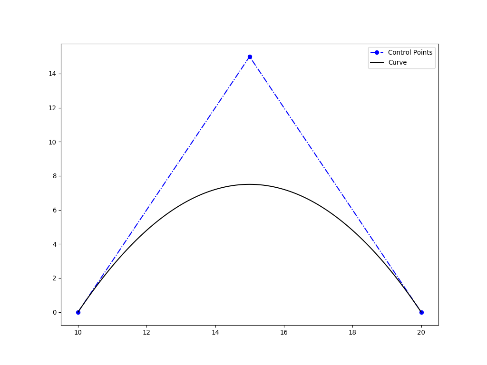
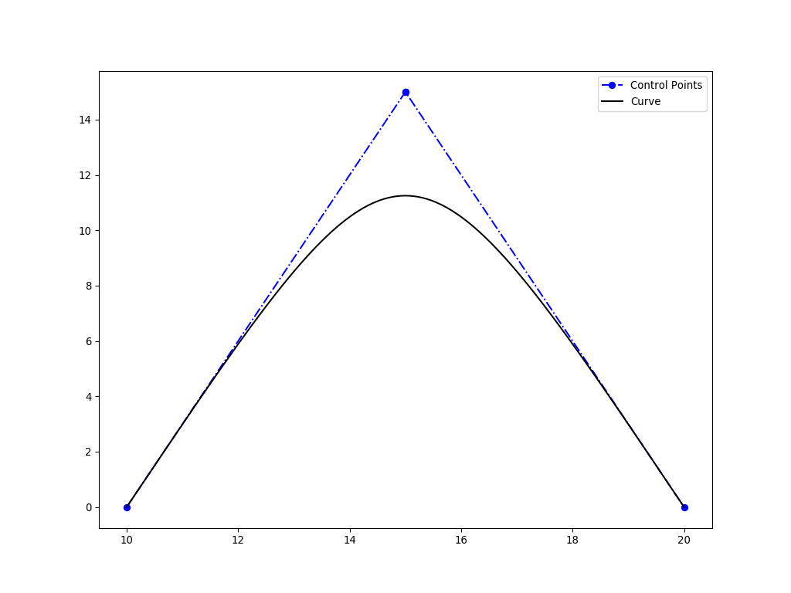
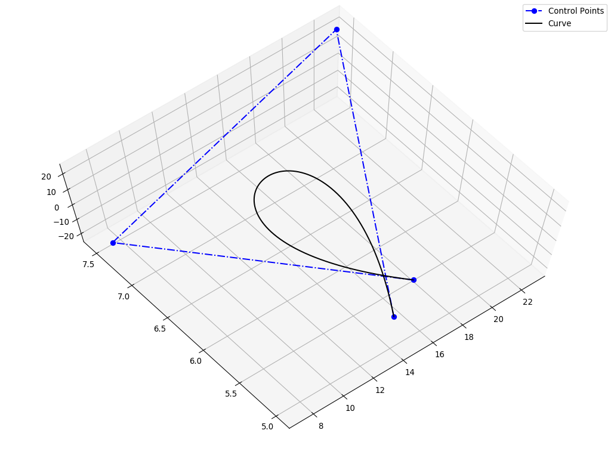
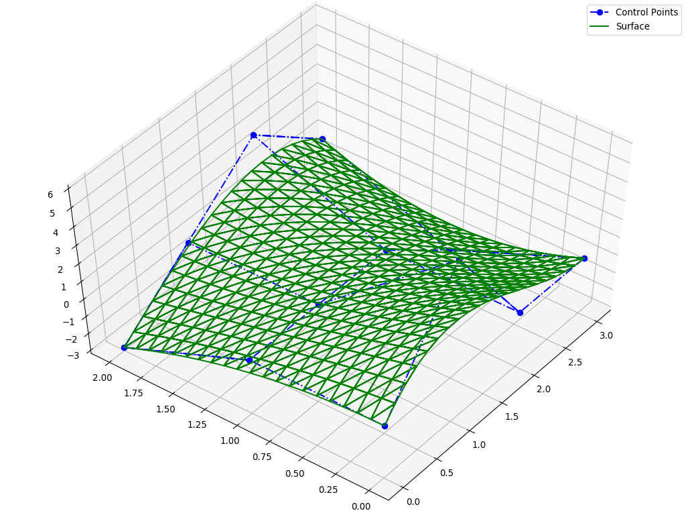

# Bézier Curves and Surfaces

This directory contains some Bézier surface and 2D/3D curve examples for NURBS-Python. Bézier curves and surfaces are
considered as a subset of NURBS and therefore, they can be generated using NURBS algorithms.

Please check the scripts in this directory on details of how to generate Bézier curves and surfaces.

## 2D Curve Examples

The following examples are generated using `ex_bezier_curve2d.py` script.

## 3D Curve Example

The following example is generated using `ex_bezier_curve3d.py` script.

## Surface Example

The following example is generated using `ex_bezier_surface.py` script.

## License

[MIT](../LICENSE)
